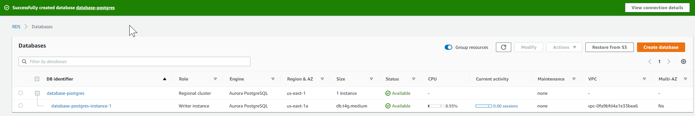
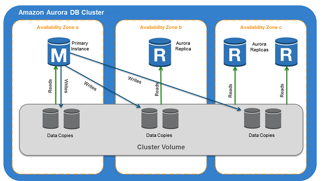
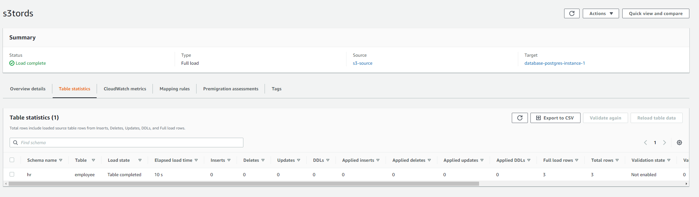

Prerequisites: 
1.) Installl PG ADMIN if you havent created one:
https://www.postgresqltutorial.com/postgresql-getting-started/install-postgresql/
2.) Use the following link to create your aurora RDS:
https://aws.amazon.com/getting-started/hands-on/create-connect-postgresql-db/
Download 
1.0 Created new DBMS

vpc-0fa9bfd4a1e33bea6	Yes	3.218.168.99	

172.31.7.76